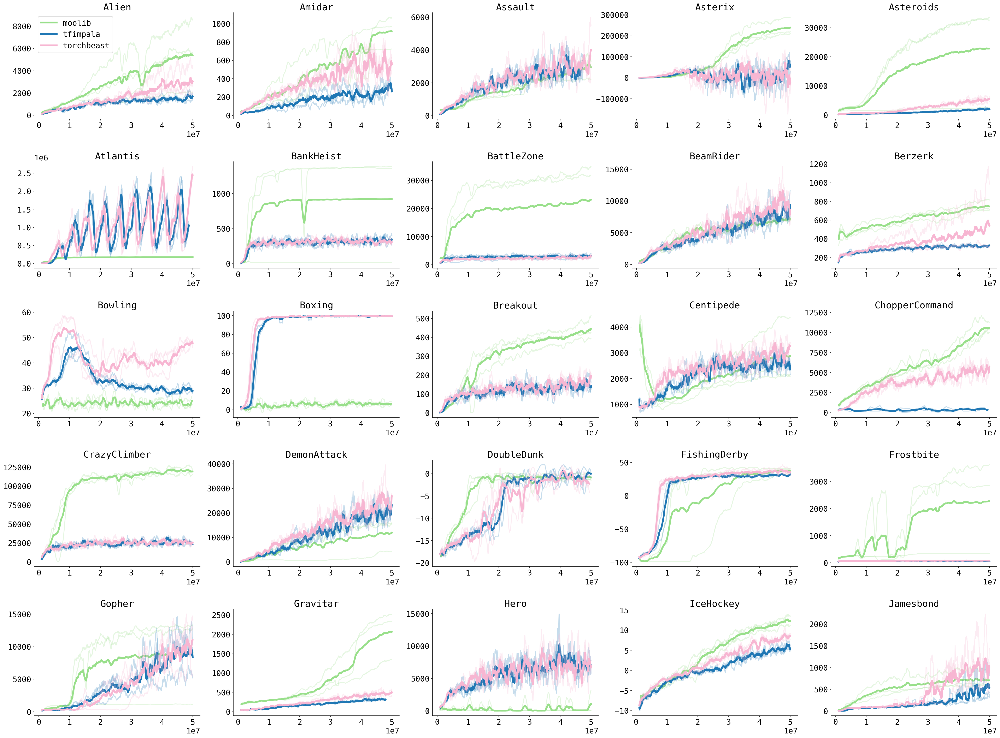

# moolib

<p align="center">
<a href="https://github.com/facebookresearch/moolib/actions/workflows/run_python_tests.yml">
  
</a>
<a href="https://github.com/facebookresearch/moolib/actions/workflows/black_flake8.yml">
  
</a>
<a href="https://github.com/facebookresearch/moolib/actions/workflows/clang-format.yml">
  
</a>
</p>

moolib - a communications library for distributed ML training

moolib offers general purpose RPC with automatic transport
selection (shared memory, TCP/IP, Infiniband) allowing models to
data-parallelise their training and synchronize gradients
and model weights across many nodes.

`moolib` is an RPC library to help you perform distributed machine
learning research, particularly reinforcement learning. It is designed
to be *highly flexible* and *highly performant*.

It is *flexible* because it allows researchers to define their own
training loops and data-collection policies with minimal interference
or abstractions - `moolib` gets out of the way of research code.

It is *performant* because it gives researchers the power of efficient
data-parallelization across GPUs with minimal overhead, in a manner
that is highly scalable.

`moolib` aims to provide researchers with the freedom to implement
whatever experiment loop they desire, and the freedom to scale it up
from single GPUs to hundreds at will (with no additional code). It
ships with a reference implementations
[IMPALA](examples/vtrace/experiment.py) on
[Atari](examples/atari/environment.py) that can easily be adapted to
other environments or algorithms.


## Installing

**To compile `moolib` without CUDA support**

    EXPORT USE_CUDA=0

To install from GitHub:

    pip install git+https://github.com/facebookresearch/moolib

To build from source:

    git clone --recursive git@github.com:facebookresearch/moolib
    cd moolib && pip install .

How to host [docs](https://facebookresearch.github.io/moolib/) (after installation):

    pip install sphinx==4.1.2
    cd docs && ./run_docs.sh


## Run an Example

To run the example agent on a given Atari level:

First, start the broker:

    python -m moolib.broker

It will output something like `Broker listening at 0.0.0.0:4431`.

Note that a **single broker is enough** for all your experiments.

Now take the IP address of your computer. If you ssh'd into your
machine, this should work (in a new shell):

```
export BROKER_IP=$(echo $SSH_CONNECTION | cut -d' ' -f3)  # Should give your machine's IP.
export BROKER_PORT=4431
```

To start an experiment with a single peer:

    python -m examples.vtrace.experiment connect=BROKER_IP:BROKER_PORT \
        savedir=/tmp/moolib-atari/savedir \
        project=moolib-atari \
        group=Zaxxon-Breakout \
        env.name=ALE/Breakout-v5

To add more peers to this experiment, start more processes with the
same `project` and `group` settings, using a different setting for
`device` (default: `'cuda:0'`).


## Documentation

  * [`moolib` whitepaper](https://research.facebook.com/publications/moolib-a-platform-for-distributed-rl/).
  * [`moolib`'s API documentation](https://facebookresearch.github.io/moolib/).


## Benchmarks

<details><summary>Show results on Atari</summary>



</details>


## Citation

```
@article{moolib2022,
  title  = {{moolib:  A Platform for Distributed RL}},
  author = {Vegard Mella and Eric Hambro and Danielle Rothermel and Heinrich K{\"{u}}ttler},
  year   = {2022},
  url    = {https://github.com/facebookresearch/moolib},
}
```


## License

moolib is licensed under the MIT License. See [`LICENSE`](LICENSE) for details.
